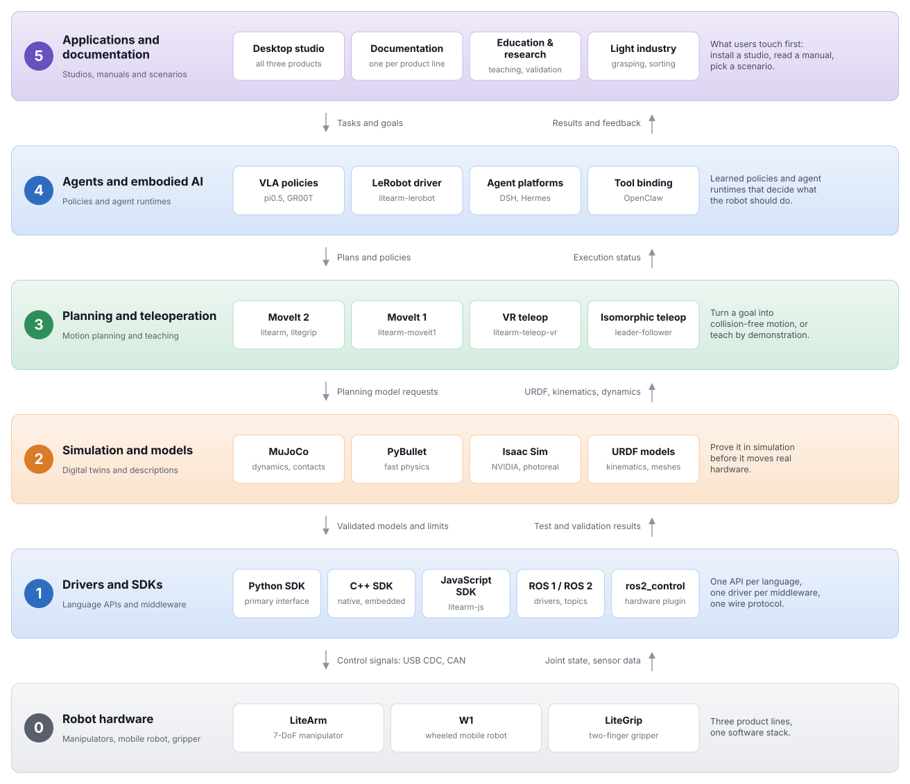

# NEXFORM ROBOTICS

**Robot hardware and software, from the servo loop to embodied AI.**

[Website](https://www.nexform.tech) · [The stack](#the-stack) · [Repository map](#repository-map) · [Where to start](#where-to-start)

---

This page maps the NEXFORM ROBOTICS organization for developers, researchers and
integrators: the three product lines, the six layers each of them is built from,
and the repository to open first. Read it from the top down and you walk the
stack from the application layer to the hardware.

## Product lines

| Product line | What it is | Documentation |
| --- | --- | --- |
| **LiteArm** | 7-DoF collaborative manipulator series, in SE, S, SL, P and PL model variants | [litearm-docs](https://github.com/nexform-tech/litearm-docs) |
| **W1** | Wheeled mobile robot with a lifting torso and two arms | [w1-docs](https://github.com/nexform-tech/w1-docs) |
| **LiteGrip** | Adaptive two-finger parallel gripper, 87 mm effective stroke, driven over USB-CAN | [litegrip-docs](https://github.com/nexform-tech/litegrip-docs) |

## The stack

Each product line is published as the same six layers. A layer uses the one below
it: an application drives a policy, the policy plans a motion, the planner
commands a driver, and the driver reaches the hardware through the model that
simulation has already validated.

<picture>
  <source media="(prefers-color-scheme: dark)" srcset="assets/stack-dark.svg">
  <source media="(prefers-color-scheme: light)" srcset="assets/stack-light.svg">
  
</picture>

## Repository map

Every repository in the organization, by layer and product line. A cell is the
product-line prefix, so `python` under LiteArm is
[`litearm-python`](https://github.com/nexform-tech/litearm-python).

| Layer | LiteArm | W1 | LiteGrip |
| --- | --- | --- | --- |
| 5 · Applications and documentation | [studio](https://github.com/nexform-tech/litearm-studio) · [docs](https://github.com/nexform-tech/litearm-docs) | [studio](https://github.com/nexform-tech/w1-studio) · [docs](https://github.com/nexform-tech/w1-docs) | [studio](https://github.com/nexform-tech/litegrip-studio) · [docs](https://github.com/nexform-tech/litegrip-docs) |
| 4 · Agents and embodied AI | [vla](https://github.com/nexform-tech/litearm-vla) · [lerobot](https://github.com/nexform-tech/litearm-lerobot) · [dsh](https://github.com/nexform-tech/litearm-dsh) · [hermes](https://github.com/nexform-tech/litearm-hermes) · [openclaw](https://github.com/nexform-tech/litearm-openclaw) | [vla](https://github.com/nexform-tech/w1-vla) | — |
| 3 · Planning and teleoperation | [moveit1](https://github.com/nexform-tech/litearm-moveit1) · [moveit2](https://github.com/nexform-tech/litearm-moveit2) · [teleop-isomorphic](https://github.com/nexform-tech/litearm-teleop-isomorphic) · [teleop-vr](https://github.com/nexform-tech/litearm-teleop-vr) | — | [moveit2](https://github.com/nexform-tech/litegrip-moveit2) |
| 2 · Simulation and models | [urdf](https://github.com/nexform-tech/litearm-urdf) · [mujoco](https://github.com/nexform-tech/litearm-mujoco) · [pybullet](https://github.com/nexform-tech/litearm-pybullet) · [isaacsim](https://github.com/nexform-tech/litearm-isaacsim) | [urdf](https://github.com/nexform-tech/w1-urdf) · [mujoco](https://github.com/nexform-tech/w1-mujoco) · [pybullet](https://github.com/nexform-tech/w1-pybullet) · [isaacsim](https://github.com/nexform-tech/w1-isaacsim) | [urdf](https://github.com/nexform-tech/litegrip-urdf) · [mujoco](https://github.com/nexform-tech/litegrip-mujoco) · [pybullet](https://github.com/nexform-tech/litegrip-pybullet) · [isaacsim](https://github.com/nexform-tech/litegrip-isaacsim) |
| 1 · Drivers and SDKs | [python](https://github.com/nexform-tech/litearm-python) · [cpp](https://github.com/nexform-tech/litearm-cpp) · [js](https://github.com/nexform-tech/litearm-js) · [ros1](https://github.com/nexform-tech/litearm-ros1) · [ros2](https://github.com/nexform-tech/litearm-ros2) · [ros2-control](https://github.com/nexform-tech/litearm-ros2-control) | [python](https://github.com/nexform-tech/w1-python) · [cpp](https://github.com/nexform-tech/w1-cpp) · [ros1](https://github.com/nexform-tech/w1-ros1) · [ros2](https://github.com/nexform-tech/w1-ros2) | [python](https://github.com/nexform-tech/litegrip-python) · [cpp](https://github.com/nexform-tech/litegrip-cpp) · [ros1](https://github.com/nexform-tech/litegrip-ros1) · [ros2](https://github.com/nexform-tech/litegrip-ros2) |
| 0 · Robot hardware | 7-DoF collaborative manipulator | wheeled mobile robot | two-finger parallel gripper |

The remaining repositories are organization infrastructure, not product code:
[`.github`](https://github.com/nexform-tech/.github) holds this page and the
community health files, and
[`repo-template`](https://github.com/nexform-tech/repo-template) holds the shared
repository standards.

## Where to start

No NEXFORM package is published to a registry yet, so both SDKs install straight
from their repositories. The commands below install the tip of `main`:

| Runtime | Package | Install |
| --- | --- | --- |
| Python 3.9 or later | [`litearm-python`](https://github.com/nexform-tech/litearm-python), imports as `litearm` | `pip install git+https://github.com/nexform-tech/litearm-python` |
| Python 3.8 or later | [`litegrip-python`](https://github.com/nexform-tech/litegrip-python), imports as `litegrip` | `pip install git+https://github.com/nexform-tech/litegrip-python` |
| C++17 | [`litearm-cpp`](https://github.com/nexform-tech/litearm-cpp) | see the repository README for the build |

| I want to | Go to |
| --- | --- |
| Understand a product | the `-docs` repository of its product line |
| Drive a robot from Python | the `-python` repository |
| Use a desktop application | the `-studio` repository |
| Simulate before buying | the `-mujoco`, `-pybullet` or `-isaacsim` repository |
| Integrate with ROS 1 or ROS 2 | the `-ros1` or `-ros2` repository |
| Train or run a policy | the `-vla` or `-lerobot` repository |

## License

Every product repository is licensed under the
[Apache License 2.0](https://www.apache.org/licenses/LICENSE-2.0). Copyright ©
2026 NEXFORM ROBOTICS.

[github.com/nexform-tech](https://github.com/nexform-tech) · [www.nexform.tech](https://www.nexform.tech) · LiteArm · W1 · LiteGrip

